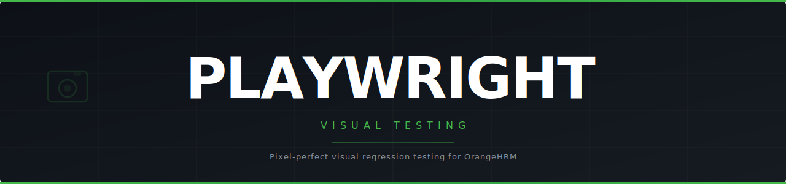

<div align="center">



### Pixel-perfect visual regression testing for OrangeHRM · Powered by Playwright

---

[](https://playwright.dev)
[](https://www.typescriptlang.org)
[](https://nodejs.org)
[](https://github.com/winstonjs/winston)
[](LICENSE)
[](https://opensource-demo.orangehrmlive.com)

</div>

---

## Overview

A Playwright visual regression testing framework targeting [OrangeHRM Demo](https://opensource-demo.orangehrmlive.com). Captures pixel-perfect baseline screenshots and fails the suite when the rendered UI drifts beyond a configurable threshold — catching unintended styling regressions before they reach production.

**Core capabilities:**
- Full-page and component-level snapshot comparison
- Dynamic content masking to prevent false positives
- Session reuse via `storageState` — login runs once per suite
- Winston structured logging across 4 output targets
- Multi-environment support via `env/.env.*` files
- Fixed 1280×720 viewport for cross-machine snapshot stability

---

## Project Structure

```
playwright-visual-testing/
├── configs/
│   ├── env.ts                        # Typed config object from process.env
│   ├── global-setup.ts               # Suite start logging (runs once)
│   └── global-teardown.ts            # Suite end logging (runs once)
├── env/
│   ├── .env.local                    # Local environment variables (default)
│   └── .env.staging                  # Staging environment variables
├── fixtures/
│   └── index.ts                      # Playwright fixture DI — loginPage, dashboardPage
├── logs/                             # Auto-created — Winston log output
│   ├── info.log
│   ├── error.log
│   └── test.log
├── pages/
│   ├── login.page.ts                 # OrangeHRM login page object
│   └── dashboard.page.ts             # OrangeHRM dashboard page object
├── snapshots/                        # Baseline screenshots (commit to source control)
├── tests/
│   ├── auth.setup.ts                 # One-time auth — saves .auth/user.json
│   └── visual/
│       ├── login.visual.spec.ts      # Visual tests — login page
│       └── dashboard.visual.spec.ts  # Visual tests — dashboard page
├── utils/
│   ├── logger.ts                     # Winston logger (4 transports)
│   └── validateEnv.ts                # Fails fast on missing env vars
├── .env.example                          # Template — copy to env/.env.local
├── playwright.config.ts
├── tsconfig.json
└── package.json
```

---

## Quick Start

```powershell
# 1. Install dependencies
npm install

# 2. Install Playwright browser
npx playwright install chromium

# 3. Create your local env file (gitignored — fill in your credentials)
Copy-Item .env.example env\.env.local   # then edit with your values

# 4. Generate baseline snapshots
npm run test:update

# 5. Run visual regression tests
npm test
```

---

## Environment Configuration

The active environment is controlled by `ENV` (defaults to `local`). Config is loaded from `env/.env.${ENV}`.

**`env/.env.local`** (gitignored — copy from `.env.example`)
```
BASE_URL=https://opensource-demo.orangehrmlive.com
MY_USERNAME=your_username
MY_PASSWORD=your_password
```

| Variable | Required | Description |
|---|---|---|
| `BASE_URL` | Yes | Base URL of the application under test |
| `MY_USERNAME` | Yes | Login username |
| `MY_PASSWORD` | Yes | Login password |
| `CI` | No | Set to `true` to enable CI mode (retries: 2, workers: 1) |

> All required variables are validated at startup — tests will not run if any are missing.

---

## Running Tests

### Generate baseline snapshots (first run)
```powershell
npm run test:update
```
Captures fresh screenshots and saves them to `snapshots/`. **Commit these to source control** — they are the ground truth for all future comparisons.

### Run visual regression suite
```powershell
npm test
```
Compares each rendered element against its baseline. Fails if pixel diff exceeds the configured threshold.

### Update snapshots after intentional UI changes
```powershell
npm run test:update
```

### Run interactively with Playwright UI
```powershell
npm run test:ui
```

### Run with a specific environment
```powershell
$env:ENV="staging"; npm test   # loads env/.env.staging
```

### Run a single test file
```powershell
npx playwright test tests/visual/login.visual.spec.ts
```

### View HTML report
```powershell
npm run report
```

### Refresh auth state (if session expires)
```powershell
npm run auth:refresh
```

### Clear log files
```powershell
npm run logs:clear
```

---

## Visual Testing Features

| Feature | Detail |
|---|---|
| **Full-page screenshot** | Captures the complete scrollable page |
| **Component snapshot** | Targets individual locators (panel, sidebar, topbar, form) |
| **Dynamic content masking** | `mask: [userDropdown]` prevents user-specific info from breaking snapshots |
| **Pixel diff tolerance** | `maxDiffPixelRatio` configurable per-test or globally in `playwright.config.ts` |
| **Fixed viewport** | 1280×720 enforced — prevents dimension drift between machines |
| **Snapshot storage** | `./snapshots/` organized by test file path |
| **Session reuse** | Auth runs once per suite; all dashboard tests start pre-authenticated |

---

## Architecture

### Page Object Model

Each page is a self-contained class with locators declared as `readonly` properties and grouped action methods.

```
fixtures/index.ts       → injects LoginPage, DashboardPage via Playwright fixture DI
pages/login.page.ts     → locators + navigate() + login()
pages/dashboard.page.ts → locators + navigate() + waitForDashboard()
```

### Winston Logger

Structured logging across 4 outputs — no `console.log` in tests:

| Output | Content |
|---|---|
| Console | Colorized real-time output during test runs |
| `logs/info.log` | Info-level only — test steps, navigation, snapshot confirmations |
| `logs/error.log` | Error-level only — failed tests, caught exceptions |
| `logs/test.log` | All levels combined — complete execution trace |

### Auth Setup

`tests/auth.setup.ts` runs once before the visual suite. It logs in, saves session state to `.auth/user.json`, and all dashboard tests reuse it — eliminating repeated logins and keeping the suite fast.

---

## Test Execution Flow

```
npm test
  ↓
Playwright reads playwright.config.ts + loads env/.env.local
  ↓
globalSetup → logs suite start boundary
  ↓
[setup] project → auth.setup.ts → logs in → saves .auth/user.json
  ↓
[chromium] project → visual test suite
  ├─ login.visual.spec.ts   (clears auth — tests login UI in clean state)
  └─ dashboard.visual.spec.ts (reuses .auth/user.json — starts pre-authenticated)
  ↓
globalTeardown → logs suite end boundary
```

---

## Snapshot Workflow

```
First run (no baselines yet)
  └── npm run test:update  →  snapshots/ written  →  commit to git

Daily CI run
  └── npm test  →  compare rendered vs baseline  →  pass / fail on diff

After intentional UI change
  └── npm run test:update  →  snapshots/ updated  →  review diff  →  commit
```

---

<div align="center">

Built with [Playwright](https://playwright.dev) · [TypeScript](https://www.typescriptlang.org) · [Winston](https://github.com/winstonjs/winston)

</div>
